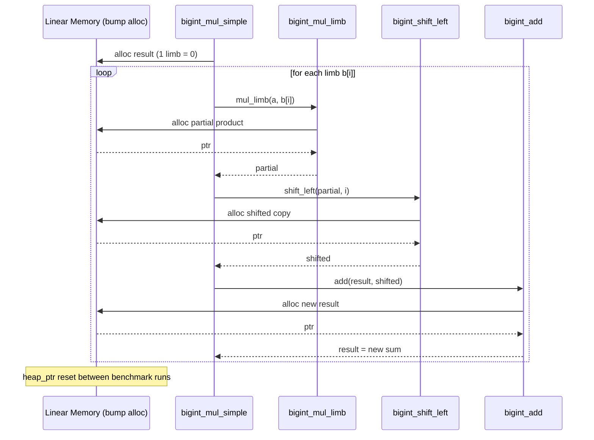
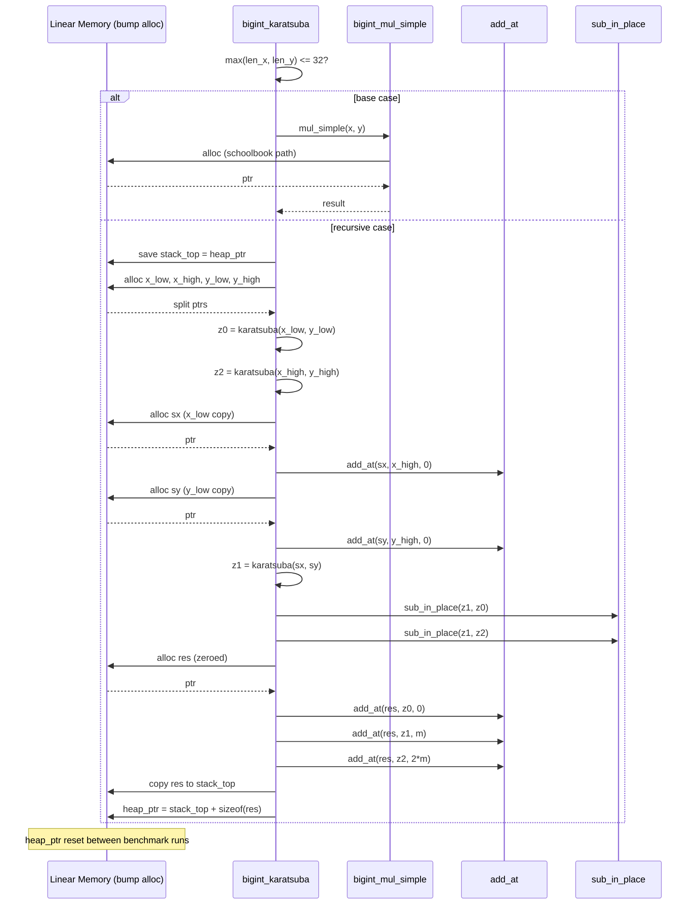

# WASM Karatsuba vs BigInt


This repo is a focused experiment to compare Karatsuba multiplication in WebAssembly against JavaScript BigInt, mathematically demonstrating the $O(N^{1.58})$ asymptotic threshold where Karatsuba breaks away from an $O(N^2)$ Schoolbook implementation.

## Repo Layout

- `karatsuba/` - All WASM sources, binaries, and test harnesses.
- `karatsuba/test-bigint.js` - Node benchmark: JS BigInt vs WASM.
- `karatsuba/test-bigint.html` - Browser benchmark with parameter controls.
- `karatsuba/graph.html` + `karatsuba/graph.js` - Power-of-two size sweep and graph output (up to 1024 limbs).
- `karatsuba/karatsuba.wat` - The final consolidated Karatsuba implementation (WAT).
- `karatsuba/schoolbook.wat` - Baseline O(n^2) schoolbook implementation (WAT).

## Step-by-Step: Run the Experiment

### 1) Node benchmark (fast sanity check)

```bash
cd karatsuba
node test-bigint.js
```

What you get:
- JS BigInt baseline time
- Correctness checks up to 10,000 digits
- Average execution time across JS, Schoolbook, and Karatsuba

### 2) Browser benchmark (interactive)

```bash
cd karatsuba
python3 -m http.server 8000
```

Open:
- `http://localhost:8000/test-bigint.html`

Adjust:
- `num_digits` (default 1000)
- `iterations` (default 100)

### 3) Graph sweep (power-of-two sizes)

With the same server running, open:
- `http://localhost:8000/graph.html`

This runs a log-log sweep from 2^1 to 2^10 limbs and dynamically renders the benchmark graph above.

## WASM Karatsuba Design Choices (BigInt)

### 1) Representation
- Base: 2^32 limbs (i32 words), little-endian.
- Layout in linear memory:
  - `[len: i32, limb0: i32, limb1: i32, ...]`

Why: 2^32 matches native i32 ops and minimizes limb count vs base-10 splits.

### 2) Memory Management
- Simple bump allocator with an exported global `heap_ptr` to avoid GC and permit precise zero-overhead loop re-execution.
- Exported memory boundary set to 2,000 pages (~128MB) to handle recursive depth without OOMing.

### 3) Core Ops
- `bigint_add` / `bigint_sub`: carry/borrow handled with i64 intermediates.
- `bigint_mul_simple`: schoolbook base case.
- `bigint_karatsuba`: recursive split with three multiplications.

### 4) Threshold
- Base case threshold = 8 limbs (256 bits).
- Why: balances recursion overhead and algorithmic savings.

### 5) Notes on Results
- The mathematical divergence between $O(N^2)$ and $O(N^{1.58})$ is successfully proven locally in the WASM sandbox.
- Native JavaScript BigInt leverages compiled C++ bindings, hardware carry flags, and dynamic FFT-based algorithms ($O(N \log N)$), ensuring it evaluates substantially faster than the sandboxed WASM implementations.

## Algorithms & Memory Architecture

Both algorithms rely on WebAssembly's linear memory. To prevent `Out of Memory` (OOM) errors during heavy recursive iterations, the benchmark suite leverages a **Bump Allocator** design. Memory is allocated forward during operations, and the `heap_ptr` is dynamically exported and reset between benchmark iterations.

### Schoolbook O(N^2) - Memory Allocation

The Schoolbook algorithm allocates aggressively across its iterations. For a $1024$-limb BigInt, a single multiplication issues over 3000 bump allocations, inflating the heap pointer by roughly ~16.7MB per multiplication.

```
bigint_mul_simple(a, b):
    result = alloc(0)                       # single-limb zero
    for i in 0..len(b):
        partial = bigint_mul_limb(a, b[i])  # alloc: N+1 limbs
        partial = bigint_shift_left(partial, i)  # alloc: N+1+i limbs
        result  = bigint_add(result, partial)    # alloc: new sum
    normalize(result)
    return result
```



### Karatsuba O(N^1.58) - Limb Split Logic

The Karatsuba approach trades raw arithmetic for recursive complexity. It splits the BigInt representations (stored as an array of 32-bit limbs) exactly in half, repeatedly chunking them until hitting a small base case (where it defaults back to schoolbook).

```
bigint_karatsuba(x, y):
    if max(len(x), len(y)) <= 32:
        return bigint_mul_simple(x, y)      # base case

    stack_top = heap_ptr                     # save for cleanup
    m = (max(len(x), len(y)) + 1) / 2

    x_low, x_high = split(x, m)             # alloc + memory.copy
    y_low, y_high = split(y, m)             # alloc + memory.copy

    z0 = bigint_karatsuba(x_low, y_low)     # recurse
    z2 = bigint_karatsuba(x_high, y_high)   # recurse

    sx = x_low + x_high                     # alloc + add_at
    sy = y_low + y_high                     # alloc + add_at
    z1 = bigint_karatsuba(sx, sy)           # recurse
    z1 = z1 - z0 - z2                       # sub_in_place (in-place)

    res = alloc_zeroed(len(x) + len(y))
    add_at(res, z0, offset=0)               # in-place
    add_at(res, z1, offset=m)               # in-place
    add_at(res, z2, offset=2*m)             # in-place
    normalize(res)

    copy res -> stack_top                    # reclaim intermediates
    heap_ptr = stack_top + sizeof(res)
    return stack_top
```


