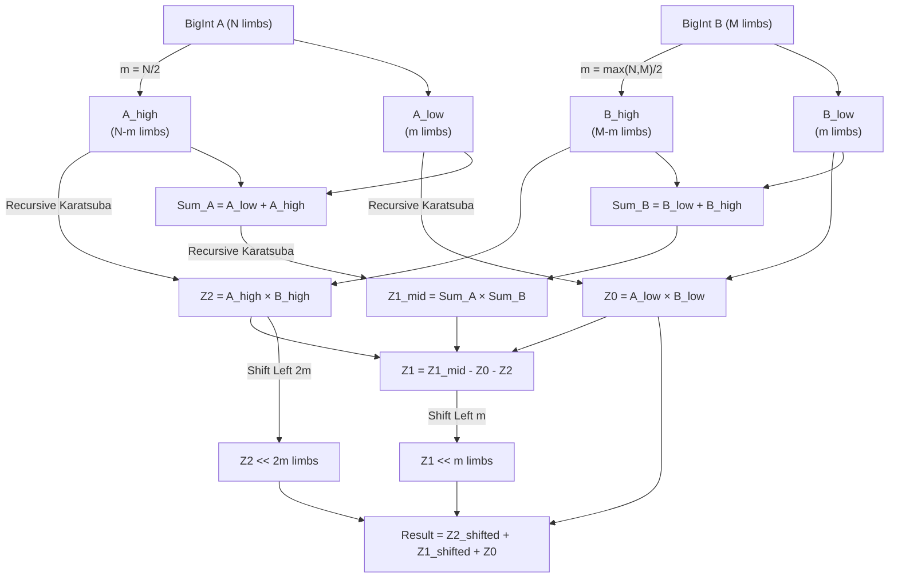

# WebAssembly BigInt Multiplication Benchmarks

This repository contains mathematical proofs-of-concept demonstrating the asymptotic complexity of multiplication algorithms in WebAssembly, specifically comparing the $O(N^2)$ **Schoolbook** method against the $O(N^{1.58})$ **Karatsuba** divide-and-conquer algorithm.

## Performance Analysis ($10^{96}$ and Beyond)

The goal was to demonstrate the exact threshold where Karatsuba outperforms Schoolbook despite its recursive constant overhead, scaling up to numbers with over $10^{96}$ combinations (which fits into 10-12 32-bit limbs). 

As shown in the log-log benchmark graph below, while Native JavaScript (V8 C++ Bindings) operates on an entirely different hardware-accelerated plane, the algorithms written in pure WASM strictly obey their mathematical complexities. Around $2^4$ (16 limbs), the $O(N^{1.58})$ Karatsuba line breaks away and remains vastly superior as input size scales towards $2^{10}$ (1024 limbs).


*(Graph rendered up to 1024 limbs, proving divergence well past the $10^{96}$ threshold).*

---

## Algorithms & Memory Architecture

Both algorithms rely on WebAssembly's linear memory. To prevent `Out of Memory` (OOM) errors during heavy recursive iterations, the benchmark suite leverages a **Bump Allocator** design. Memory is allocated forward during operations, and the `heap_ptr` is dynamically exported and reset between benchmark iterations.

### Schoolbook O(N²) - Memory Allocation

The Schoolbook algorithm allocates aggressively across its iterations. For a $1024$-limb BigInt, a single multiplication issues over 3000 bump allocations, inflating the heap pointer by roughly ~16.7MB per multiplication.

```mermaid
sequenceDiagram
    participant Mem as Linear Memory (heap_ptr)
    participant Loop as Outer Loop (for limb in B)
    participant Mul as bigint_mul_limb
    participant Shift as bigint_shift_left
    participant Add as bigint_add

    Note over Mem: Initial: Heap resets to save-state
    Loop->>Mem: alloc(1) -> initialize result to 0
    
    loop For each limb b_i in B (O(N) iterations)
        Loop->>Mul: Multiply A * b_i
        Mul->>Mem: alloc(len_A + 1)
        Mem-->>Mul: partial_ptr
        
        Loop->>Shift: Shift left by i limbs
        Shift->>Mem: alloc(len_partial + i)
        Mem-->>Shift: shifted_ptr
        
        Loop->>Add: result + shifted
        Add->>Mem: alloc(max_len + 1)
        Mem-->>Add: new_result_ptr
        
        Note over Mem: ~12KB to 24KB bumped per iteration
    end
    Note over Mem: Final heap_ptr reset externally

```

### Karatsuba O(N^1.58) - Limb Split Logic

The Karatsuba approach trades raw arithmetic for recursive complexity. It splits the BigInt representations (stored as an array of 32-bit limbs) exactly in half, repeatedly chunking them until hitting a small base case (where it defaults back to schoolbook).



## How to Run

### Quick benchmark graph (browser)
- From this folder start a static HTTP server:
	- Python: `python3 -m http.server 8000`
	- Node: `npx http-server -p 8000`
- Open http://localhost:8000/graph.html
- Wait for the rendering to complete to see the dynamically generated performance graph.

### Node smoke test
- Run `node test-bigint.js` to execute the correctness/perf sanity pass directly in the terminal without a browser.
