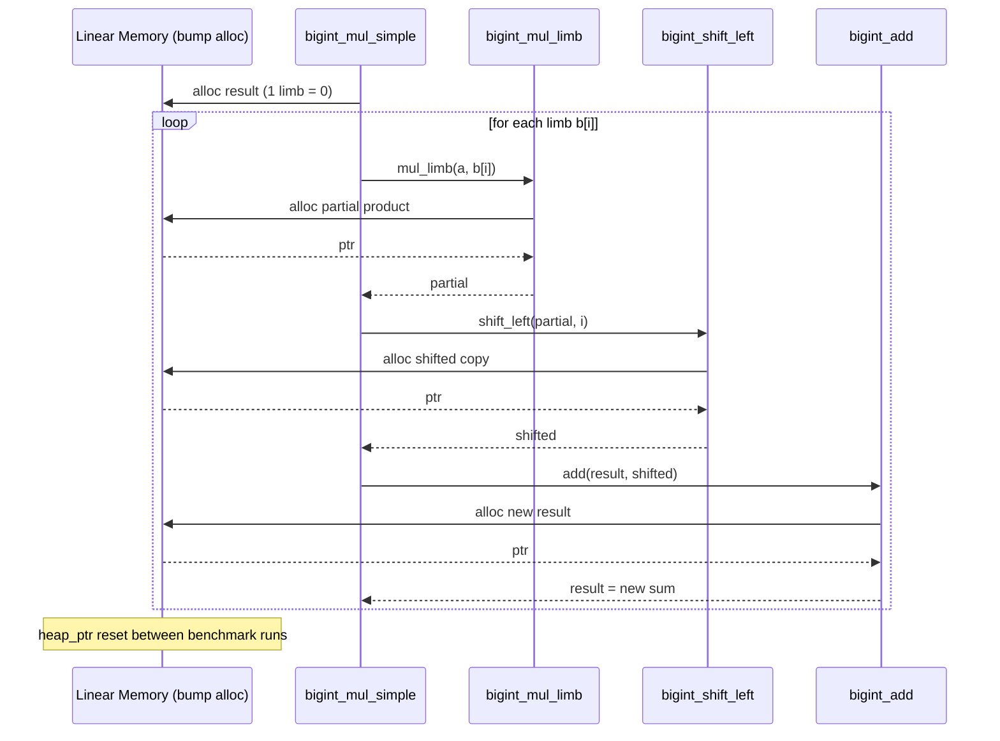
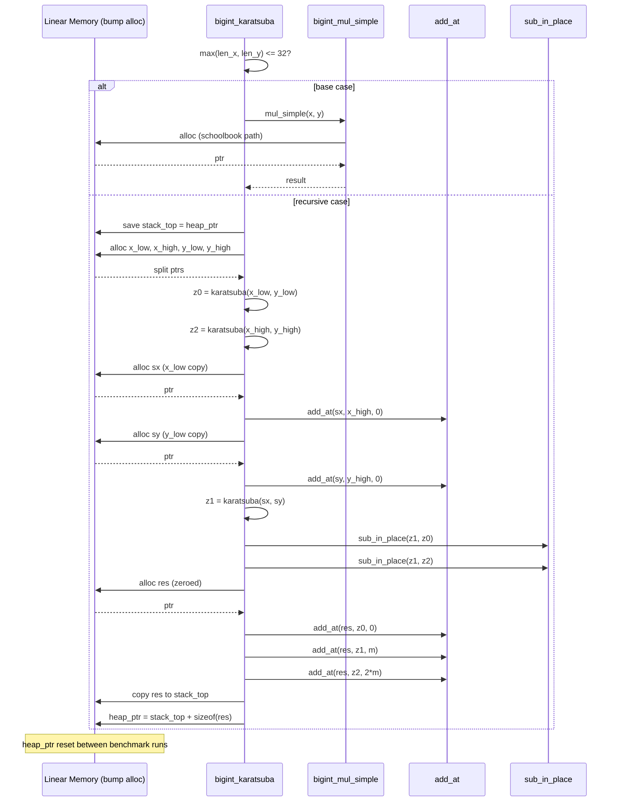

# WebAssembly BigInt Multiplication Benchmarks

This repository contains mathematical proofs-of-concept demonstrating the asymptotic complexity of multiplication algorithms in WebAssembly, specifically comparing the $O(N^2)$ **Schoolbook** method against the $O(N^{1.58})$ **Karatsuba** divide-and-conquer algorithm.

## Performance Analysis ($10^{96}$ and Beyond)

The goal was to demonstrate the exact threshold where Karatsuba outperforms Schoolbook despite its recursive constant overhead, scaling up to numbers with over $10^{96}$ combinations (which fits into 10-12 32-bit limbs). 

As shown in the log-log benchmark graph below, while Native JavaScript (V8 C++ Bindings) operates on an entirely different hardware-accelerated plane, the algorithms written in pure WASM strictly obey their mathematical complexities. Around $2^4$ (16 limbs), the $O(N^{1.58})$ Karatsuba line breaks away and remains vastly superior as input size scales towards $2^{10}$ (1024 limbs).


*(Graph rendered up to 1024 limbs, proving divergence well past the $10^{96}$ threshold).*

---

## Algorithms & Memory Architecture

Both algorithms rely on WebAssembly's linear memory. To prevent `Out of Memory` (OOM) errors during heavy recursive iterations, the benchmark suite leverages a **Bump Allocator** design. Memory is allocated forward during operations, and the `heap_ptr` is dynamically exported and reset between benchmark iterations.

### Schoolbook O(N^2) - Memory Allocation

The Schoolbook algorithm allocates aggressively across its iterations. For a $1024$-limb BigInt, a single multiplication issues over 3000 bump allocations, inflating the heap pointer by roughly ~16.7MB per multiplication.

```
bigint_mul_simple(a, b):
    result = alloc(0)                       # single-limb zero
    for i in 0..len(b):
        partial = bigint_mul_limb(a, b[i])  # alloc: N+1 limbs
        partial = bigint_shift_left(partial, i)  # alloc: N+1+i limbs
        result  = bigint_add(result, partial)    # alloc: new sum
    normalize(result)
    return result
```



### Karatsuba O(N^1.58) - Limb Split Logic

The Karatsuba approach trades raw arithmetic for recursive complexity. It splits the BigInt representations (stored as an array of 32-bit limbs) exactly in half, repeatedly chunking them until hitting a small base case (where it defaults back to schoolbook).

```
bigint_karatsuba(x, y):
    if max(len(x), len(y)) <= 32:
        return bigint_mul_simple(x, y)      # base case

    stack_top = heap_ptr                     # save for cleanup
    m = (max(len(x), len(y)) + 1) / 2

    x_low, x_high = split(x, m)             # alloc + memory.copy
    y_low, y_high = split(y, m)             # alloc + memory.copy

    z0 = bigint_karatsuba(x_low, y_low)     # recurse
    z2 = bigint_karatsuba(x_high, y_high)   # recurse

    sx = x_low + x_high                     # alloc + add_at
    sy = y_low + y_high                     # alloc + add_at
    z1 = bigint_karatsuba(sx, sy)           # recurse
    z1 = z1 - z0 - z2                       # sub_in_place (in-place)

    res = alloc_zeroed(len(x) + len(y))
    add_at(res, z0, offset=0)               # in-place
    add_at(res, z1, offset=m)               # in-place
    add_at(res, z2, offset=2*m)             # in-place
    normalize(res)

    copy res -> stack_top                    # reclaim intermediates
    heap_ptr = stack_top + sizeof(res)
    return stack_top
```



## How to Run

### Quick benchmark graph (browser)
- From this folder start a static HTTP server:
	- Python: `python3 -m http.server 8000`
	- Node: `npx http-server -p 8000`
- Open http://localhost:8000/graph.html
- Wait for the rendering to complete to see the dynamically generated performance graph.

### Node smoke test
- Run `node test-bigint.js` to execute the correctness/perf sanity pass directly in the terminal without a browser.
